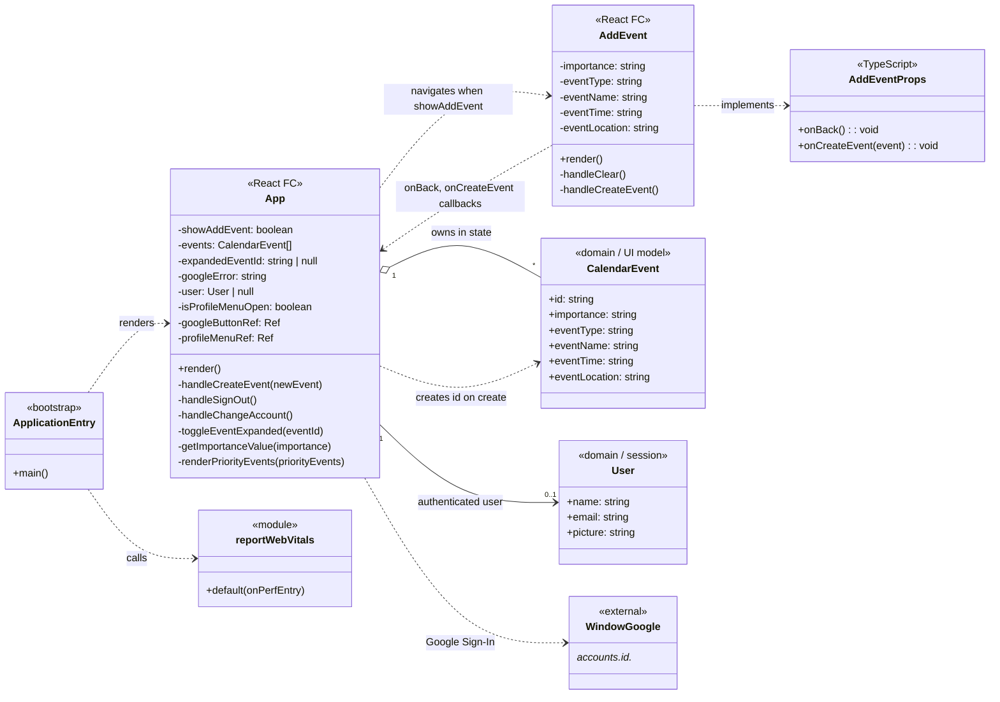

# Class diagram (Miro-style UML form)

Reference board: [Miro — class diagram template](https://miro.com/app/board/uXjVNaxNYCA=/?share_link_id=142184382650)

The link above does not expose the canvas to automated viewers, so this document follows the **standard UML class diagram layout** commonly used on Miro: **name** (top), **attributes / fields** (middle), **operations / responsibilities** (bottom), plus **associations** and **dependencies** between types.

It reflects the current **Busy Bee Calendar** React app in `src/`.

**Single image (all classes and links):** [`class-diagram-full.svg`](class-diagram-full.svg) (view in browser or VS Code).

**Editable diagram:** [`class-diagram-full.drawio`](class-diagram-full.drawio) — open in [diagrams.net](https://app.diagrams.net/) (File → Open from…) or the **Draw.io Integration** extension in VS Code.

---

## Diagram (Mermaid — render in GitHub, VS Code, or Miro via screenshot / recreate)

---

## Same structure as Miro boxes (tabular “three compartments”)

Use this table to redraw shapes on the board to match your template colors and spacing.

### `ApplicationEntry` (`index.tsx`)

| Name | `ApplicationEntry` «bootstrap» |
| --- | --- |
| Attributes | *(none — entry script)* |
| Operations | `main()` — `createRoot`, `render(<App />)`, invoke `reportWebVitals` |

### `App` (`App.tsx`)

| Name | `App` «React FC» |
| --- | --- |
| Attributes | `-showAddEvent`, `-events`, `-expandedEventId`, `-googleError`, `-user`, `-isProfileMenuOpen`, `-googleButtonRef`, `-profileMenuRef` |
| Operations | `render()`, `-handleCreateEvent`, `-handleSignOut`, `-handleChangeAccount`, `-toggleEventExpanded`, `-getImportanceValue`, `-renderPriorityEvents` |

### `AddEvent` (`addEvent.tsx`)

| Name | `AddEvent` «React FC» |
| --- | --- |
| Attributes | `-importance`, `-eventType`, `-eventName`, `-eventTime`, `-eventLocation` |
| Operations | `render()`, `-handleClear`, `-handleCreateEvent` |

### `AddEventProps` (TypeScript)

| Name | `AddEventProps` «TypeScript» |
| --- | --- |
| Attributes | *(callbacks as contract)* `onBack`, `onCreateEvent` |
| Operations | — |

### `CalendarEvent` (in-memory model)

| Name | `CalendarEvent` «domain» |
| --- | --- |
| Attributes | `+id`, `+importance`, `+eventType`, `+eventName`, `+eventTime`, `+eventLocation` |
| Operations | — |

### `User` (session view model)

| Name | `User` «domain» |
| --- | --- |
| Attributes | `+name`, `+email`, `+picture` |
| Operations | — |

### `reportWebVitals` (`reportWebVitals.ts`)

| Name | `reportWebVitals` «module» |
| --- | --- |
| Attributes | — |
| Operations | `default(onPerfEntry)` |

### `WindowGoogle` (external API)

| Name | `WindowGoogle` «external» |
| --- | --- |
| Attributes | `window.google.accounts.id` |
| Operations | `initialize`, `renderButton`, `prompt`, `revoke`, `disableAutoSelect` |

---

## Relationships (for connectors on the board)

- **ApplicationEntry → App**: dependency — mounts the root component.
- **ApplicationEntry → reportWebVitals**: dependency.
- **App → CalendarEvent**: composition (events live in `App` state; discarded with session unless persisted later).
- **App → User**: association 0..1 (signed-in user).
- **App → AddEvent**: dependency / navigation — conditional render.
- **AddEvent → App**: dependency — props callbacks `onBack`, `onCreateEvent`.
- **App → WindowGoogle**: dependency — OAuth / JWT decode helpers.

If your Miro frame uses different arrowheads (association vs aggregation vs composition), map **composition** to “events owned by `App` state” and **dependency** to “imports / calls / external script”.
